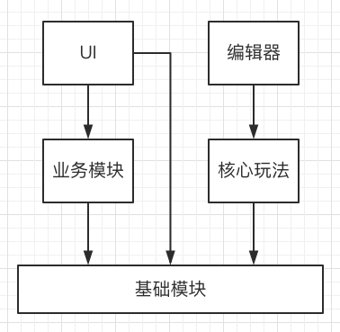

# 系统框架

## 模块系统
- 业务模块
    - 注册登录
    - 主城
    - 关卡
- 基础模块
    - 模块管理
    - UI管理
    - 用户管理
    - 资源管理
    - 配置管理
    - 网络管理
    - 支付管理
    - 分享管理
- 核心玩法
    - 单局战斗
    - 网络匹配
    - 技能系统
    - BUFF系统
    - AI系统
- 编辑器
    - 关卡编辑器
    - 皮肤编辑器

## 模块依赖

