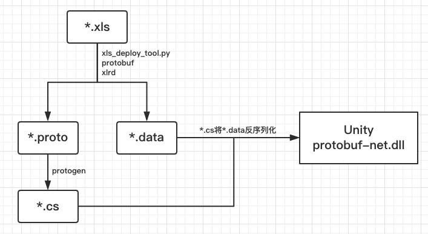

# 将xls转成protobuf供Unity使用的流程

### 注意事项
* 项目路径不能有空格
* ios link.xml 控制dll解析不被删除问题
* ios Application.streamingAssetsPath 目录下的文件读取限制 用File.OpenRead

### 流程图

* .xls表格文件，先通过xls_deploy_tool.py生成对应的.data文件和.proto文件，其中.data文件就是表格数据序列化后的结果，而.proto文件则是用于生成反序列化时使用的解析类的中间状态
* 解析类.proto经过protogen.exe转化为特定的语言，这里我们需要得到的是C#解析类，即.cs类
* 在Unity中导入protobuf-net.dll库，在C#代码中调用上述生成的.cs解析类来解析.data中的数据