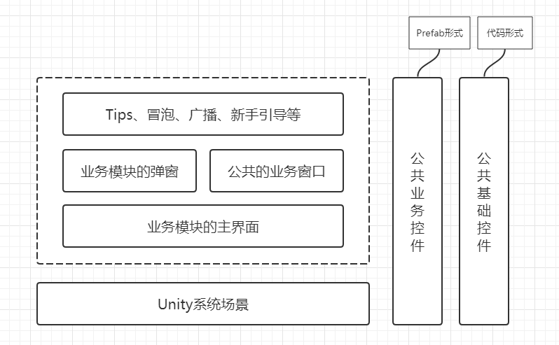
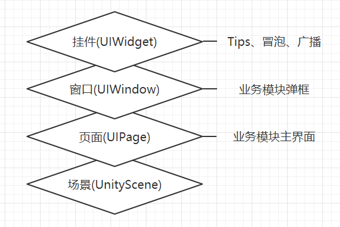

# 基础类库设计

## 目录结构
```sh
└── Foundation              # 基础类库
    ├── Common              # 公共
    ├── Debugger            # 日志
    ├── Module              # 模块
    ├── UI                  # UI
    └── Utils               # 工具
```

## Common
- Singleton 单例模式

## Debugger
- Debuger
    - 控制开关：[Conditional("ENABLE_LOG")] 和 EnableLog 
- DebugerExtension 静态类加this扩展
    - this.Log(...)

## Module

## UI
- 游戏UI需求

- UI的分类及层次结构
